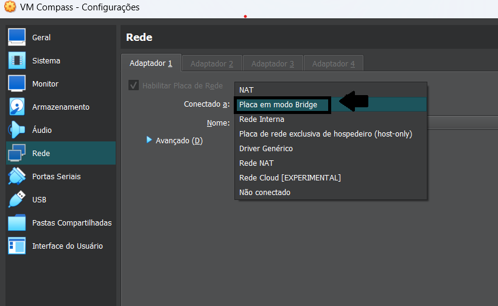
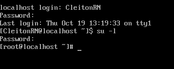
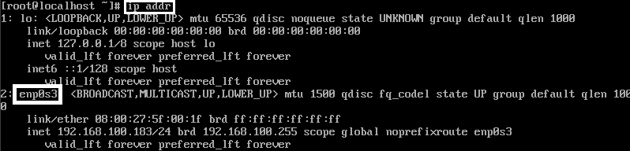
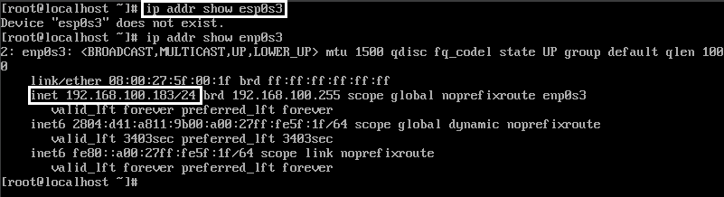
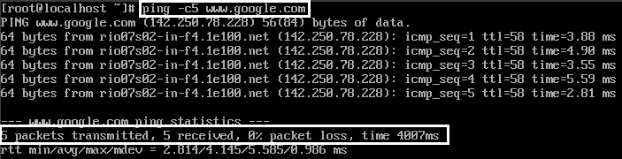
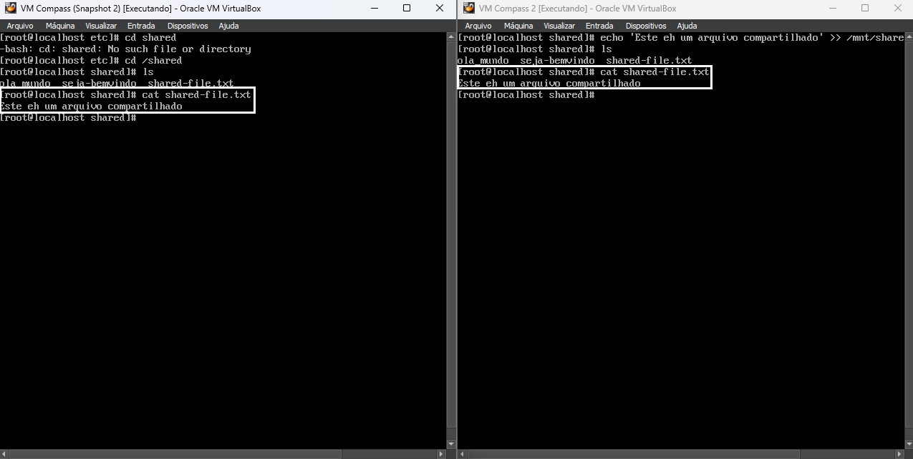

<p align="center">
  <a href="" rel="noopener">
 </a>
</p>

<h1 align="center">Instalando e configurando duas VMs com IPs fixos e NFS</h1>
<p align="center"><i>Através desse repositório irei documentar o passo a passo para instalar e configurar duas VMs (Virtual Machine) sem GUI, e logo depois configurar um IP fixo para cada uma, além disso, criarei um NFS do servidor 1 para o servidor 2.</i></p>

---
## 📝 Tabela de conteúdos

- [Instalando VM sem interface gráfica](#step1)
- [Configurando os IPs Fixos nas VMs](#step2)
- [Criando e configurando NFS (Network File System)](#step3)


## 🖥️ Instalando VM sem interface gráfica (Passo 1)<a name = "step1"></a>

Para instalar a VM sem interface gráfica, siga todos os passos do [Desafio 1](https://github.com/CleitonOS/compass-linux-desafio1),
até chegar em "Software Selection (Passo 5 - instrução 5.)" e selecione a opção "Server" ou "Minimal Install".
- Não esqueça de configurar o seu usuário root e usuário comum:

  

## 🔧 Configurando os IPs Fixos nas VMs (Passo 2)<a name = "step2"></a>
1. Antes de qualquer coisa, verifique se sua placa de rede está configurada no "Modo Bridge" nas configurações do VirtualBox.

    

2. Verifique os IPs disponíveis na sua rede para que não aja conflito. Garanta que o IP que você vai utilizar esteja dentro do intervalo de IPs disponíveis. Você checar isso pelas configurações do seu modem ou utilizando "nmap" no Linux.

3. Identifique as informações da rede, informações como:
    - Endereço IP desejado para cada servidor.
    - Máscara de sub-rede.
    - Gateway padrão.
    - DNS primário e secundário (opcional).

4. Acessando a VM1, faça o login com seu usuário criado. Neste momento você vai precisar de permissões de superadministrador (root).
  - Utilize o seguinte comando para acessar o modo root:
    ```
    su -y 
    ```
  - Insira a senha criada na instalação para o usuário root
  
    
  
  - Observação: você também pode dar permissão para o seu usuário comum utilizar o comando sudo para obter mais segurança.

5. Edite os arquivos de configuração de rede.
  - O arquivo de configuração da rede principal em sistemas Oracle Linux é
    ```
    /etc/sysconfig/network-scripts/ifcfg-<NOME_DA_SUA_INTERFACE>
    ```
  - Para descobrir qual é o nome da sua interface utilize "ip addr" como na imagem. No meu caso, o nome da minha interface é "enp0s3".
    

  - Voltando ao arquivo de configuração, execute o seguintes comandos:
    - Caso não seja um usuário root utilize esses comandos. (Sendo root, não é necessário utilizar "sudo".)
    ```
    sudo nano /etc/sysconfig/network-scripts/ifcfg-enp0s3
    ```

  - Dentro do arquivo de configuração, substitua os valores em Caixa Alta para os da sua rede:
    ```
    DEVICE=NOME_DA_INTERFACE
    BOOTPROTO=none
    ONBOOT=yes
    IPADDR=SEU_ENDERECO_IP
    NETMASK=SUA_MASCARA_DE_SUBREDE
    GATEWAY=SEU_GATEWAY
    DNS1=SEU_SERVIDOR_DNS_1
    DNS2=SEU_SERVIDOR_DNS_2 (opcional)

    ```
  
  - Após preencher as informações, reinicie a interface de rede:
      - Use o seguinte comando para reiniciar a interface de rede:
      ```
      sudo systemctl restart NetworkManager.service
      ```
  
  - Verifique se as configurações estão corretas:
      ```
      ip addr show <INTERFACE>
      ```
      
      
      - Este comando mostrá as configurações de rede da interface, incluindo o IP configurado.

  - Por último, faça um teste de conectividade, utilize o comando "ping" para isso:
      
      

      - Se tudo der certo, o comando retornará "5 packets transmitted, 5 received, 0% packet loss".
  
  
  <h3 align="center">Agora repita os mesmos passos para o segundo servidor para configurar o IP fixo. </br>Utilize um IP diferente do primeiro servidor.</h3>

  ---


## 📨 Criando e configurando NFS do servidor 1 para o servidor 2 (Passo 3) <a name = "step3"></a>
1. Para começar baixe o NFS Server. No caso do Oracle Linux, utilize este comando:
    	
      ```
      sudo dnf install -y nfs-utils
      ```

2. Configure a exportação de diretórios:
    - Edite o arquivo de configuração do NFS, que é geralmente o "etc/exports", caso não tenha crie um.
    - Dentro arquivo faça da seguinte forma:
      - Dê um nome a uma pasta que você deseja compartilhar (ela precisa estar criada - por exemplo, "shared" é o nome da minha pasta)
      - Em seguida coloque o IP do servidor 2
    ```
      /shared IP_DO_SERVIDOR2(rw,sync,no_root_squash,no_subtree_check)
    ```
    - Algumas observações sobre os comandos:
      - "rw": Permite que o servidor Linux 2 leia e escreva no compartilhamento.
      - "sync": Garante que as operações de escrita sejam confirmadas antes de retornar um sucesso.
      - "no_root_squash": Permite ao usuário root do servidor Linux 2 ter os mesmos privilégios no compartilhamento que no servidor Linux 1.
      - "no_subtree_check": Desativa a verificação de subdiretórios.

3. Verifique o status do serviço NFS e ative-o:
    - Execute o seguinte comando para verificar o status do serviço NFS no servidor:

      ```
      sudo systemctl status nfs-server
      ```

    - Se estiver inativo, você pode iniciar o serviço com o comando:
      ```
      sudo systemctl start nfs-server
      ```
      e
      ```
      sudo systemctl enable nfs-server
      ```
      Assim ele estará configurado para iniciar automaticamente após a reinicialização.

4. Após alterar o arquivo "/etc/exports", atualize as configurações do NFS Server:
    ```
    sudo systemctl reload nfs-server 
    ```

5. Configure o Firewall no servidor Linux 1 e permita o tráfego do NFS
  - Permitindo tráfego do NFS de forma permanente:
    ```
    sudo firewall-cmd --zone=public --permanent --add-service=nfs

    ```
  - Atualizando configurações do firewall:
    ```
    sudo firewall-cmd --reload
    ```

6. Agora no servidor Linux 2, repita as instruções anteriores de 1 a 4. 

    Com o NFS devidamente configurado, você deve montar o compartilhamento NFS no servidor Linux 2.

    ```
    sudo mount IP_DO_SERVIDOR_LINUX1:/shared /mnt/shared
    ```
    - Esse é um diretório ("/mnt/shared") de compartilhamento que foi montado no servidor 2.
    - Você pode utilizar os nomes de pastas que quiser.

7. Por último, teste o acesso ao compartilhamento NFS:
    ```
    echo "Este é um arquivo compartilhado!" >> /mnt/shared/shared-file.txt
    ```
    ```
    cat /mnt/shared/shared-file.txt
    ```

  - Compartilhamento entre as duas VMs:

    
